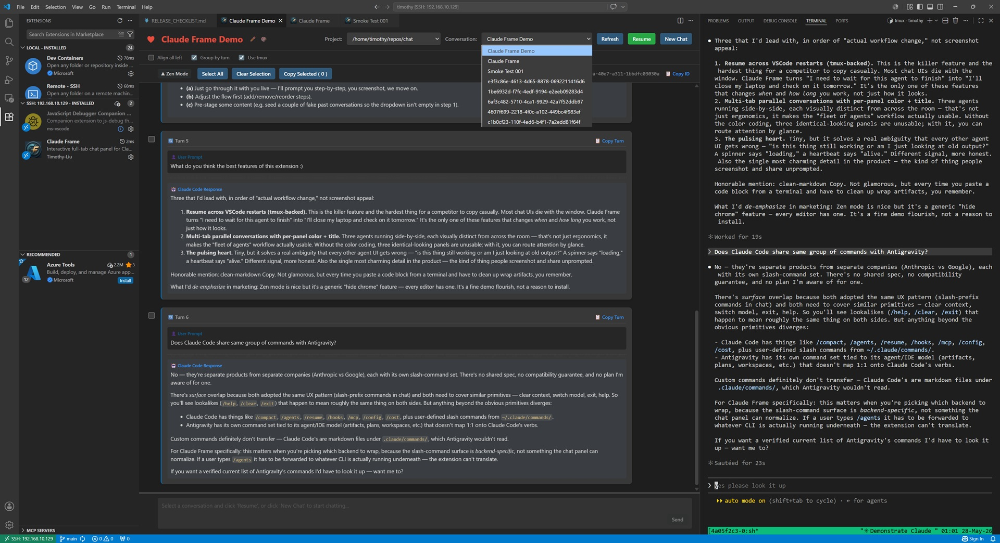

# Claude Frame

A polished VS Code chat panel for command-line AI coding agents.

## ✨ Why you'll love it

- **♥ A beating heart.** A small heart pulses next to the conversation title whenever your agent is alive. When you're only browsing past history, it sits still. A glance tells you whether the conversation is active.
- **🎨 Per-conversation color and title.** Pick any color from the native color picker. Name the conversation anything you like. Both persist across restarts. Three parallel conversations are distinguishable from across the room.
- **📋 Pristine copy, paste anywhere.** Every bubble has its own Copy button, every code block has its own — and what comes out is clean Markdown, not terminal scrollback with line-wrap artifacts and trailing whitespace. The command in a fenced code block works the moment you paste it into a shell. Use **Copy Selected** to grab multiple turns at once.
- **🪟 Multi-tab concurrency.** `Cmd+Alt+C` opens a new chat panel every time. Run several agent sessions side by side in editor tabs, each visually distinct.
- **🔁 One-click Resume across VS Code restarts.** With tmux on, your agent keeps running after you close VS Code. Reopen the extension, click **Resume**, and you're back where you left off — possibly with work already finished while you were away.
- **🧘 Zen mode.** Hide the chrome with one click. The heart and title slide into the badge row; the conversation area takes over the screen. Everything else falls away.
- **⌨️ Out of your way.** `Cmd+Alt+C` (macOS) / `Ctrl+Alt+C` (Linux & Windows) opens or focuses a chat from anywhere in VS Code. No mouse needed.

<!-- TODO: screenshot showing 3-4 panels with distinct accent colors -->

## 🚀 Quick Start

1. **Install your AI agent CLI.** Currently supported: [Claude Code](https://docs.claude.com/en/docs/claude-code/overview) (Anthropic's official CLI).
2. **(Strongly recommended) install tmux.** `brew install tmux` on macOS, `apt install tmux` on Debian/Ubuntu. See [Why tmux makes everything better](#-why-tmux-makes-everything-better) below.
3. **Install Claude Frame** from the VS Code Marketplace, or grab the latest `.vsix` from [Releases](../../releases).
4. Press `Cmd+Alt+C` (macOS) or `Ctrl+Alt+C` (Linux/Windows). Pick a project, click **New Chat** to start fresh, or pick a past conversation and click **Resume**.

For a step-by-step walkthrough, see [USER_MANUAL_EN.md](USER_MANUAL_EN.md).

## 🛠 Why tmux makes everything better

If `tmux` is installed, the **Use tmux** checkbox is on by default — and you should leave it on. Here's why.

With **tmux on**, the extension keeps a single long-lived agent process running inside a detached tmux session named after the conversation ID. Each user turn just hands the new message to that already-running process:

- **Cheaper.** The prior conversation stays in the model's prompt cache, so each subsequent turn is billed at roughly 10% of normal input-token cost. The cache key only rolls when the agent CLI is upgraded or the cache TTL expires (5 min on API keys, 1 hour on subscriptions); a live process keeps the cache continuously warm.
- **Faster.** No per-turn startup. The agent binary is already loaded; tools, MCP servers, and project context are already initialized.
- **Survives VS Code restarts.** The tmux session is detached, so closing VS Code (or losing your SSH connection) doesn't kill the agent. Reopen the extension, pick the same conversation, and you're back where you were — the agent may even have finished work while you were away.

With **tmux off**, each user turn runs a fresh non-interactive agent invocation (one-shot mode). It works, but pays the cold-start cost on every turn: process startup, conversation re-read, full context re-ingestion (the prompt cache helps but isn't free), and ~1–2 seconds of latency before the model starts. The agent also exits between turns, so closing VS Code ends the conversation.

Use tmux-off mode when you genuinely want a one-shot view of a session without a background process — a quick read-only browse, or a machine where you don't want long-running agents.

Windows users currently need [WSL](https://learn.microsoft.com/en-us/windows/wsl/install) for tmux.

## ⚙️ Configuration

None required. The extension uses VS Code's theme and font automatically.

To rebind the open shortcut: `Preferences → Keyboard Shortcuts → search "Claude Frame: Open"`.

## 🧩 Supported agents

Currently:
- **[Claude Code](https://docs.claude.com/en/docs/claude-code/overview)** — Anthropic's official CLI.

The backend system is pluggable. Each backend is a self-contained module under `src/backends/` implementing a small `AgentBackend` interface (project / conversation listing, file-based event streaming, spawn / resume / send / interrupt / teardown). Adding a new agent is largely additive — no changes to the UI layer. Pull requests welcome.

## License

[MIT](LICENSE).

---

中文文档:[README_CN.md](README_CN.md)  ·  详细用户手册:[USER_MANUAL_EN.md](USER_MANUAL_EN.md) / [USER_MANUAL_CN.md](USER_MANUAL_CN.md)
